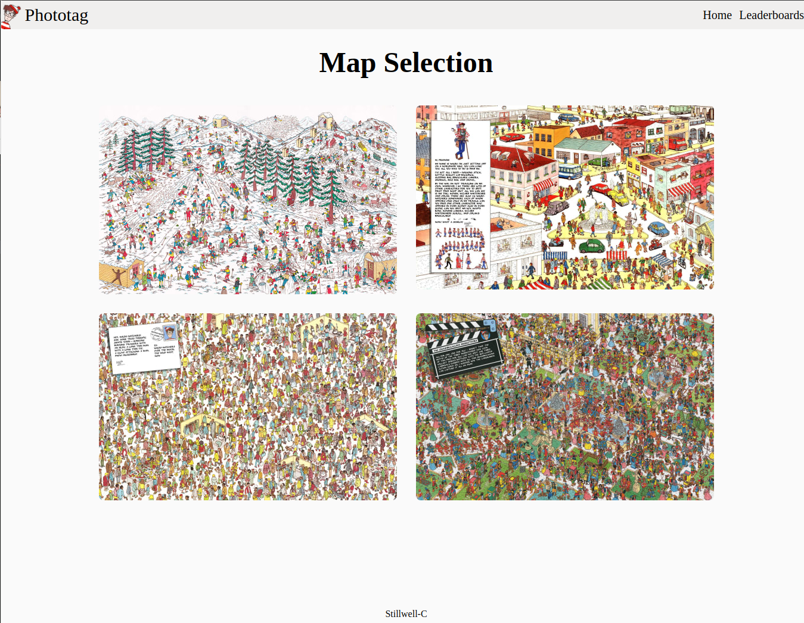
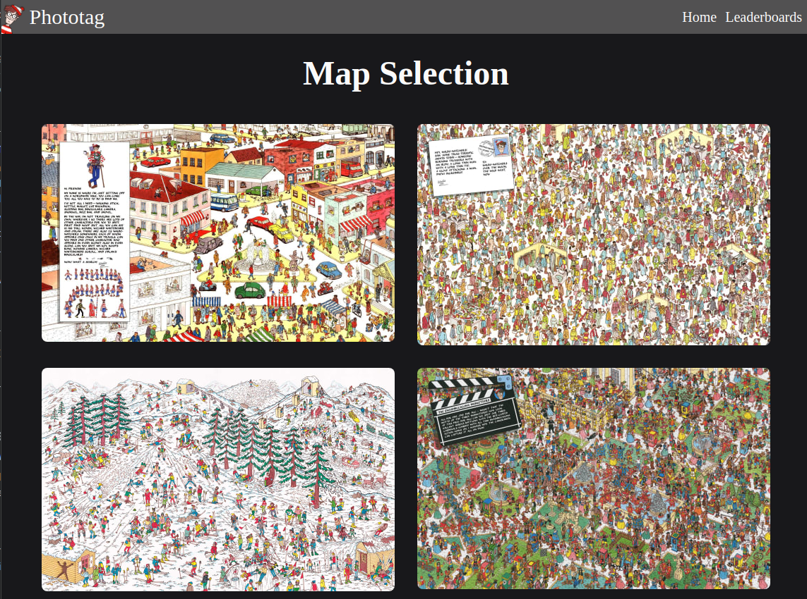
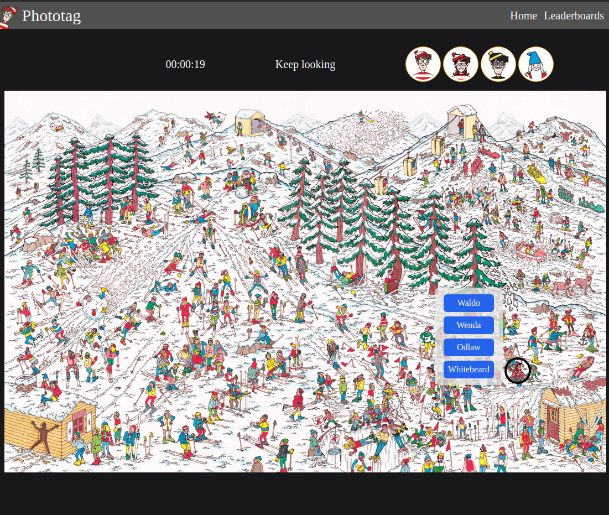
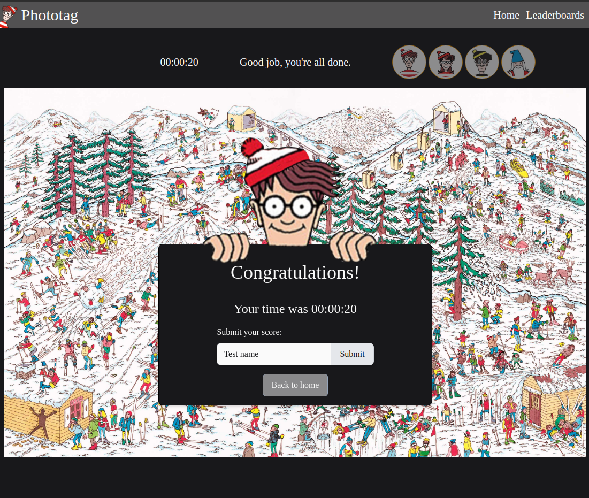
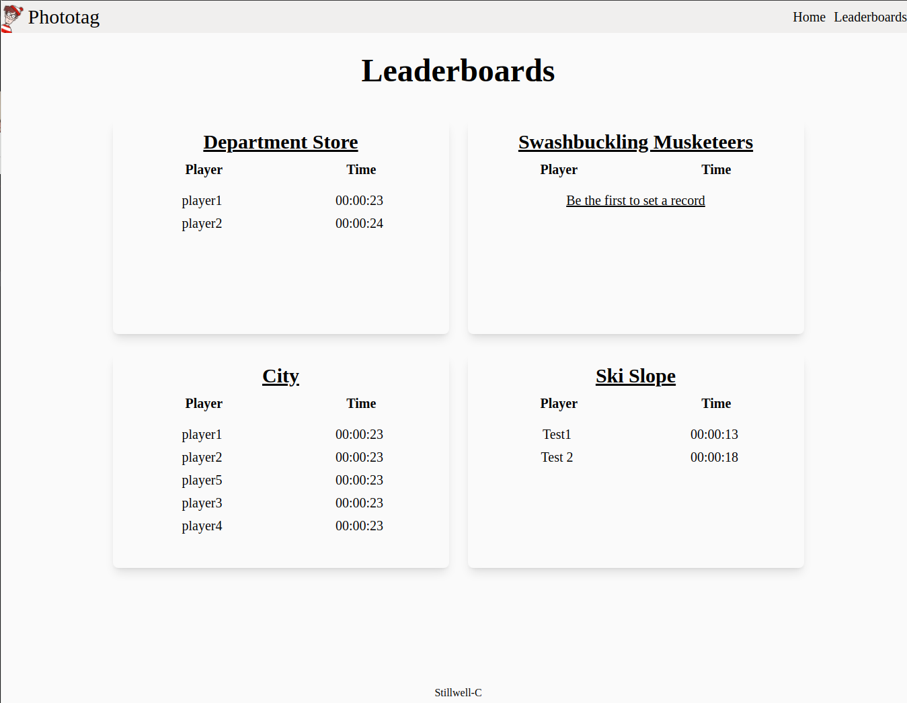
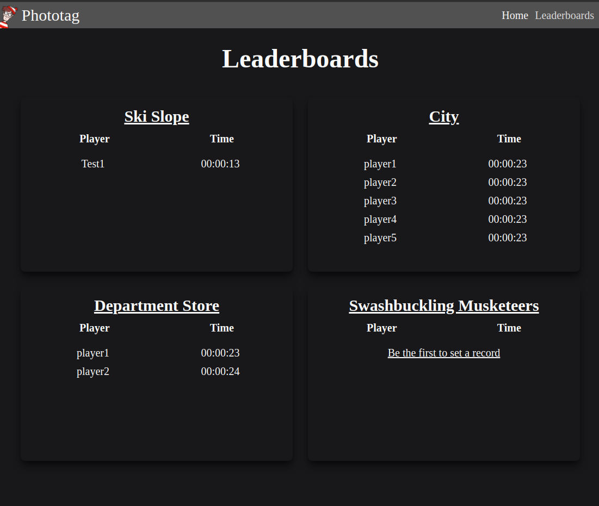
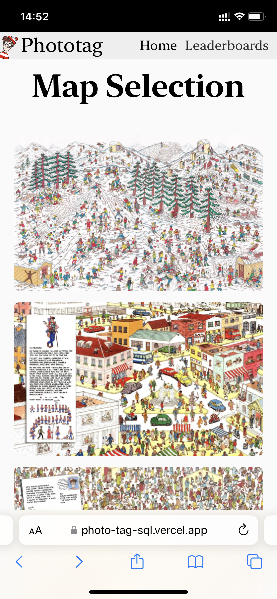
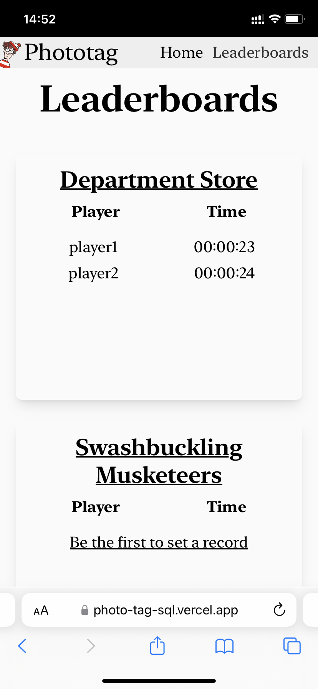
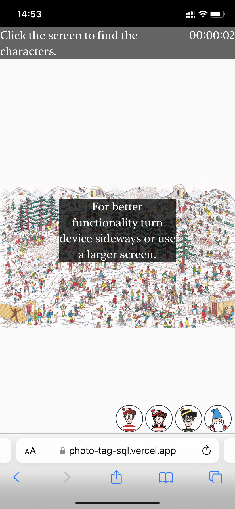

# PhotoTag

This repository is the frontend for Photo-Tag, a PERN stack photo tagging game.

I originally made this while following the React course from [The Odin Project's](https://www.theodinproject.com/) curriculum as a front end only app. I updated it to be a full stack application to practice a number of technologies, notably Typescript, Tailwind CSS, and PostgreSQL.

The MERN stack implementation of this app can be found on the main branch [here](https://github.com/Stillwell-C/photoTag).

## Demo

The application is live at https://photo-tag-sql.vercel.app/

## Backend code

View the backend code [here](https://github.com/Stillwell-C/photoTagApi/tree/postgreSQL)

## Description

### Overview

- Built using PERN stack / postgreSQL / REST API
- Reponsive, mobile-first UI
- Tailwind CSS
- Typescript front & back ends
- React Context API
- Font end tested with Jest / React Testing Library
- Find all four characters to submit your name and time
- The fastest 5 times for each map are displayed on the leaderboards page

### Detailed Description

This application is a simple photo tag puzzle game.

#### UI

The UI was made to be responsive with a mobile-first design and should function on both mobile devices and web browsers with larger screens.

On smaller screens, users are given the option to double the size of the image for better functionality. Additionally, if a game is started on a very small screen, the use will see a message for 5 seconds prompting them to turn their device sideways or use a larger screen for a better experience.

Tailwind CSS was used to style all components. There is a dark and light mode that is toggled through the user's system preference.

##### Front end

I converted and improved the original Javascript front end to work with Typescript. I also chose to imploy the React Context API for the components involved in the game functionality. It may not be necessary on this scale of application, but it was a good opportunity to practice this feature with Typescript.

#### API

Once users have finished finding all characters on a given map, they have the option to submit their name. If they are within the 5 fastest times, their time will be displayed on the leaderboards page. Displays are filtered based firstly on their time and then on the time and date the score was submitted in the case of duplicate times.

If no player has submitted a score on a particular map, the leaderboard for the map will display a link to the map prompting users to set the first score.

There are some minor differences between the postgreSQL and MongoDB implementations of this app beyond the database query code, such as variable capitalization and type of variables (e.g. MongoDB IDs are strings & PostgreSQL IDs are numbers). However, the majority of the code for is the same.

The [cors](https://www.npmjs.com/package/cors) package is used to only allow requests from specific origins. In this case, I am only allowing requests originating from the frontend.

## Built with

### Frontend

- ReactJS
- Context API
- Typescript
- React Router
- Axios
- Tailwind CSS
- JEST / React Testing Library

### Backend

- NodeJS
- ExpressJS
- PostgreSQL
- Cloudinary (image storage)

## Screenshots

### Desktop

#### Homepage

#### Game

#### Name Submission

#### Leaderboard

### Mobile

#### Homepage

#### Leaderboards

#### Game Screen Size Warning

#### Game in Landscape

#### 2X Zoom Option with Game in Landscape

